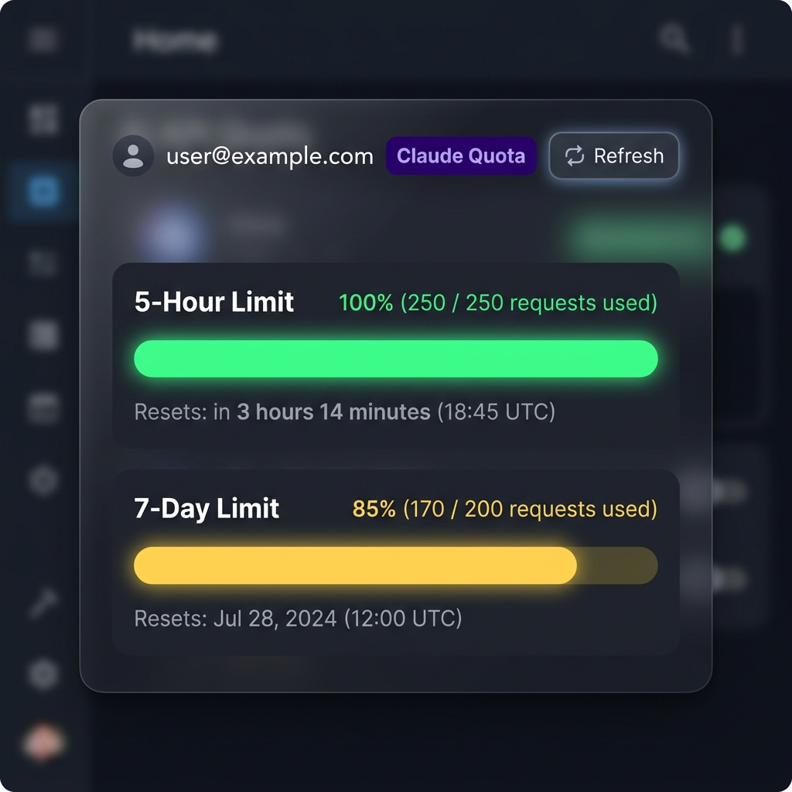

# AI Quota Custom Card

A Home Assistant custom Lovelace card to display AI API quotas (Claude, Antigravity, Codex) utilizing `CLIProxyAPI` as the backend.
The design mimics the beautiful interface of `zero-limit`.



## Installation

[](https://my.home-assistant.io/redirect/hacs_repository/?owner=WolfzHouse&repository=AI-Quota-Card&category=plugin)

### Method 1: HACS (Recommended)
1. Open HACS in your Home Assistant.
2. Click the three dots in the top right corner and select **Custom repositories**.
3. Add the URL of this repository.
4. Select Category: **Lovelace**.
5. Click Add and then Download the "AI Quota Card" repository.
6. Refresh your dashboard.

### Method 2: Manual Installation
1. Go to your Home Assistant configuration directory (`/config`).
2. If it does not exist, create a folder named `www` inside it.
3. Copy `ai-quota-card.js` into `www` (so its path is `/config/www/ai-quota-card.js`).
4. Go to Home Assistant -> Configuration -> Dashboards -> Resources (top right three dots).
5. Add a new resource:
   - URL: `/local/ai-quota-card.js`
   - Resource Type: **JavaScript Module**

## Configuration

Add a manual card on your dashboard and paste the following configuration:

```yaml
type: custom:ai-quota-card
proxy_url: https://my-proxy.domain.com # Your CLIProxyAPI URL (Local IP or Cloudflared Tunnel)
proxy_token: YOUR_MANAGEMENT_KEY # Optional: If your proxy requires a management token
provider: claude # One of: claude, antigravity, codex
auth_index: "0" # The index mapped in your CLIProxyAPI config
email: claude-account@example.com
```

### Options

| Name | Type | Requirement | Description |
| ---- | ---- | ----------- | ----------- |
| `type` | string | **Required** | `custom:ai-quota-card` |
| `proxy_url` | string | **Required** | URL where CLIProxyAPI runs. Ensure CORS is not blocking it. |
| `proxy_token`| string | Optional | If your CLIProxyAPI uses a Management Key, insert it here. |
| `provider` | string | **Required** | Name of the AI Provider (`claude`, `antigravity`, `codex`, or `gemini-cli`). |
| `auth_index` | string | Optional | `auth_index` used by CLIProxyAPI representing the account (Default: 0). |
| `email` | string | Optional | The account or alias you want to display on the card header. |
| `gemini_project_id` | string | Optional | Only required if `provider: gemini-cli`. The Google Cloud Project ID to query quota for. |

## Troubleshooting
- **API Error / No Data**: Ensure the proxy URL is accessible from your browser (checking CORS is important since HA interacts from the browser side). Ensure the token/auth mapped at the backend is active.
